# 🚀 **Tour Recommender App** 🌍

Welcome to the **Tour Recommender App**! This app helps users discover parks based on their selected outdoor activities, providing personalized recommendations with real-time data, navigation, and detailed park information. It also offers additional features such as **User Reviews**, **Travel Tips**, **Photo Gallery**, and **Feedback** to enhance the user experience.

## Features 🌟

- **Personalized Recommendations**: Select activities (hiking, biking, fishing, etc.) and get park recommendations based on your preferences.
- **Search & Filter**: Easily search for parks by name and filter by available activities.
- **Detailed Park Information**: View descriptions, available activities, and park locations.
- **Navigation Integration**: Get directions to parks with built-in Google Maps support.
- **User Reviews**: Read reviews from other users to help you decide which parks to visit.
- **Travel Tips**: Discover helpful travel tips for each park, including what to pack, best visiting times, and more.
- **Photo Gallery**: Browse a gallery of images for each park to get a better sense of the location.
- **Feedback**: Submit your feedback to improve the app and suggest new features.
- **User History**: View previously selected activities for quicker access.
- **User Profile**: View and  Edite User Profile.

## 📱 Screenshots
## Home Screen: Dash board have tiles.
  
## Preference Screens after navigation to Browse
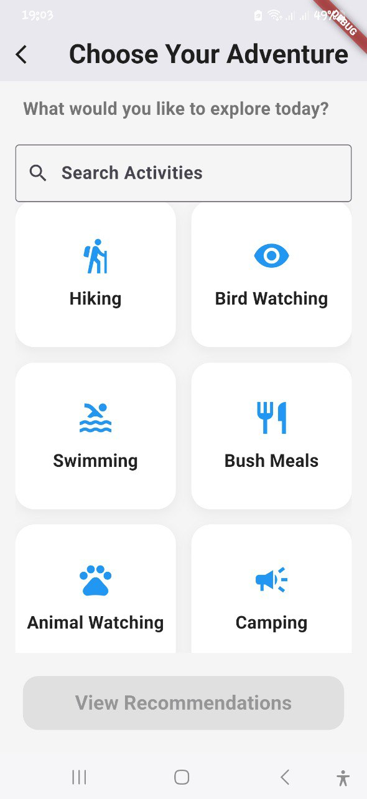 
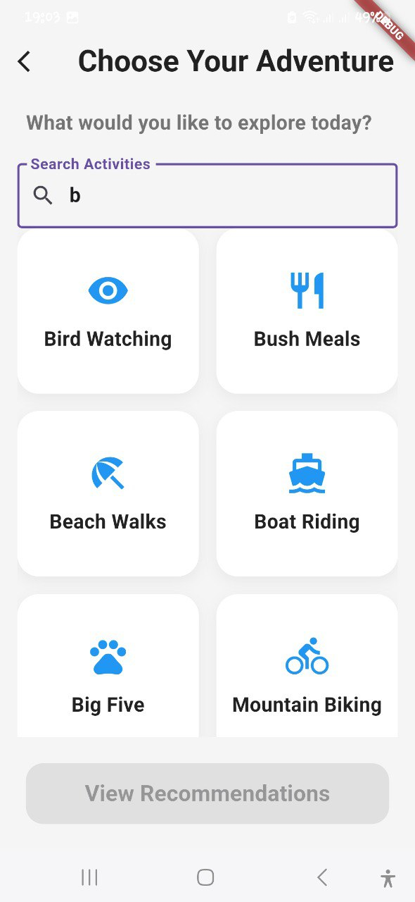 
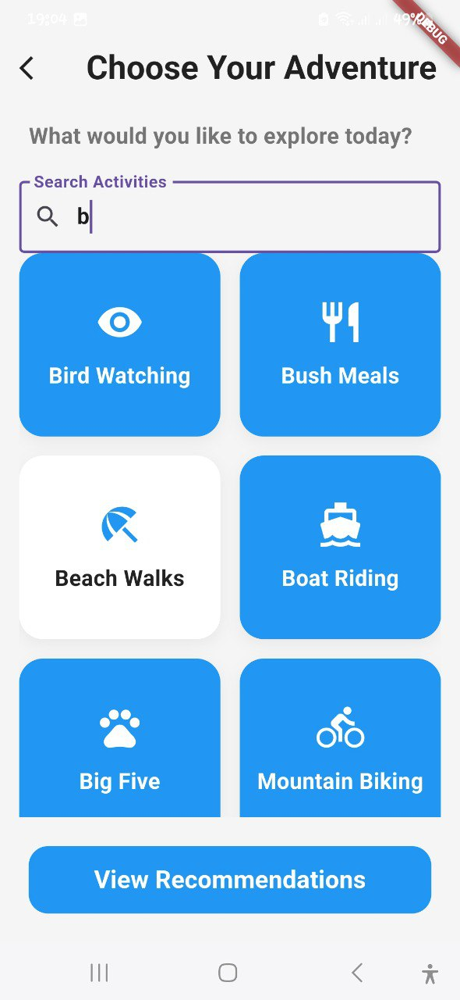
*Recommendations: See personalized park suggestions based on your selected activities.*
## Recommendation Screen

## Recommendation Screen
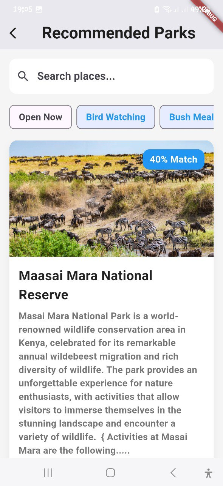
## Recommendation Screen
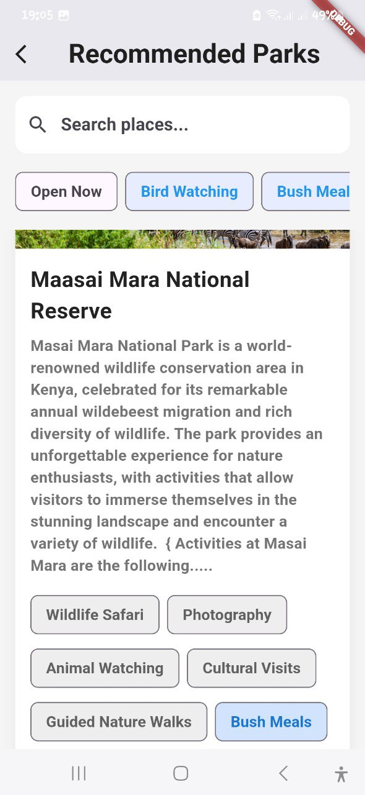
## Recommendation Screen
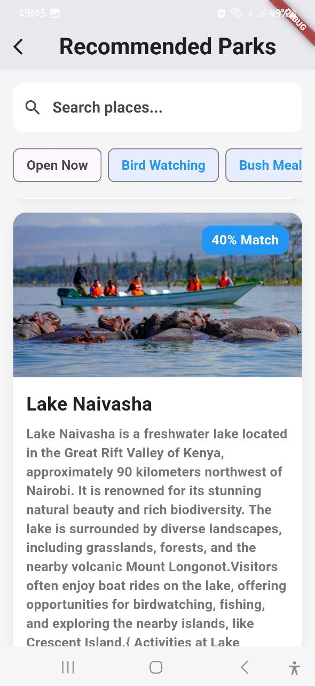  
*Recommendations: See personalized park suggestions based on your selected activities.*

## Park Details: Get more info about each park, its activities,read Write user reviews, Travel Tips, User Profiles, Gallery, Favorites, 
## Travels Tips screen
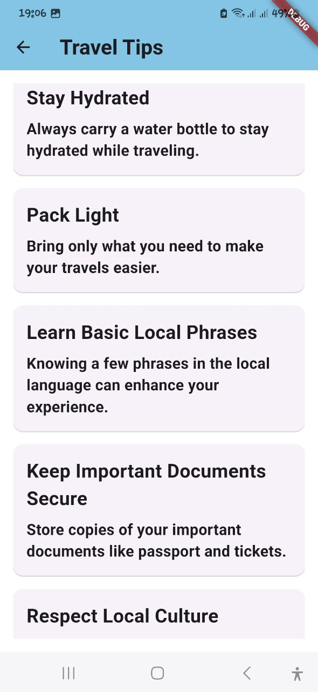 
## Read User Reviews
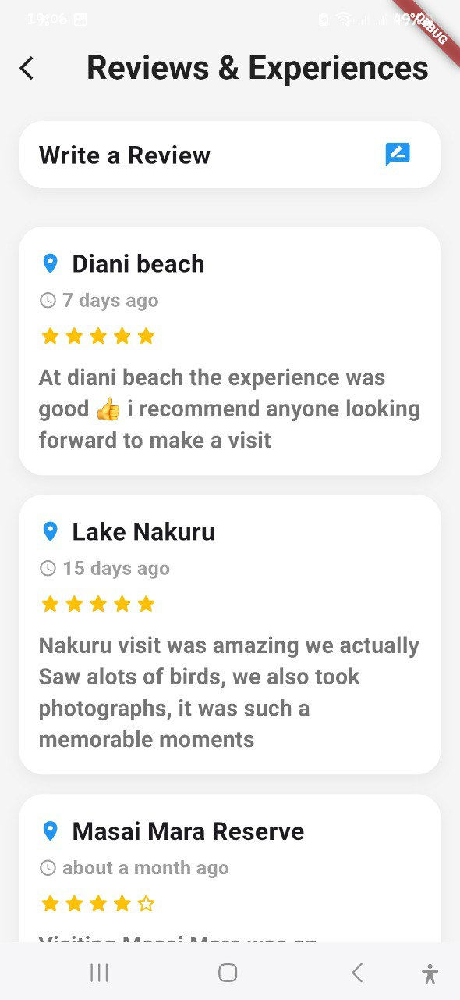
## Write User Reviews
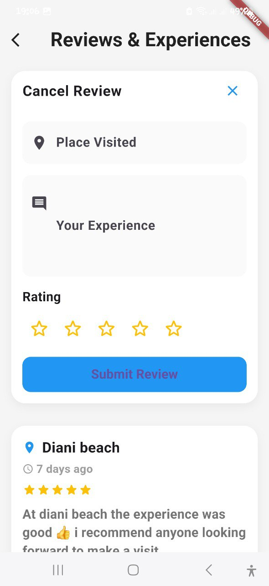
## Gallery Screen
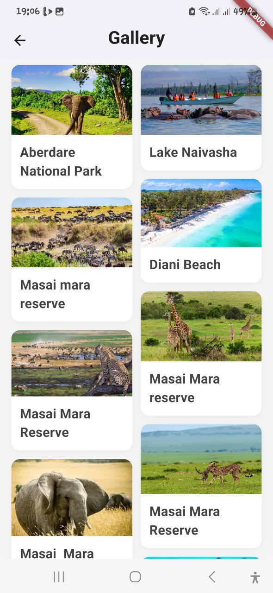
## My favorites has List of favorite Parks
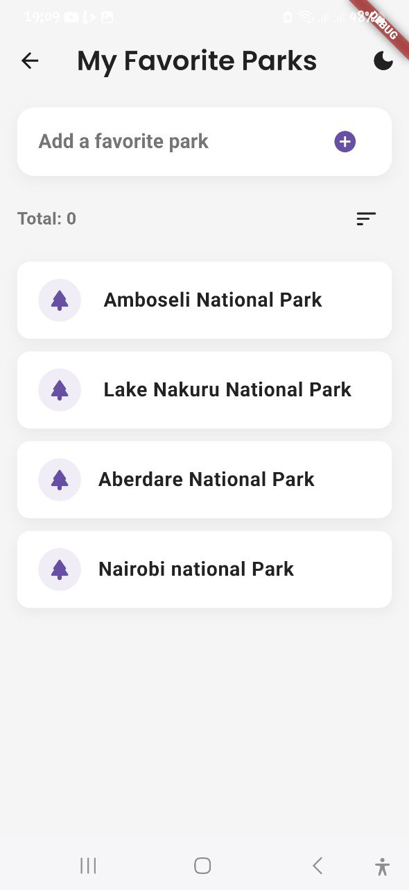
## User Profile
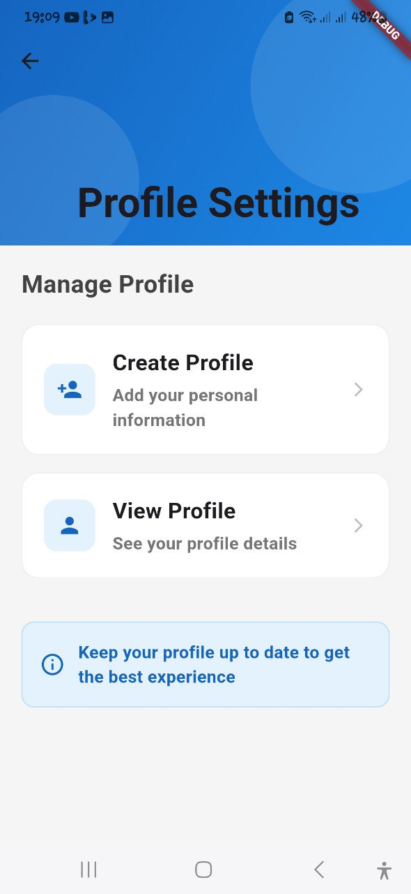
## View User details
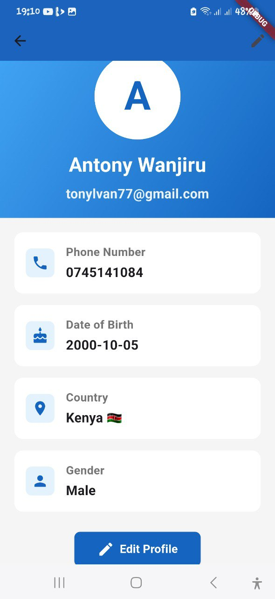
## Create User Profile
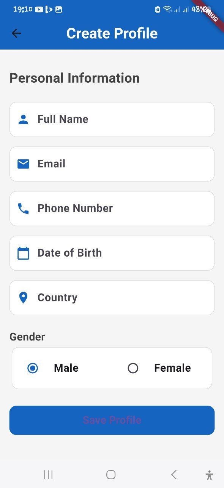


---

## 🛠️ Technologies

- **Flutter**: The cross-platform mobile framework for fast development.
- **Firebase**: Backend as a service for storing park data and user preferences.
- **Google Maps API**: Directions and location visualization for parks.
- **Dart**: Programming language used to build the app.

---

## 🚀 Getting Started

### Prerequisites

Before you start, make sure you have the following installed:

- [Flutter SDK](https://flutter.dev/docs/get-started/install)
- [Dart SDK](https://dart.dev/get-dart)
- [Firebase Account](https://firebase.google.com/)
- Code editor (e.g., [VS Code](https://code.visualstudio.com/))

### Installation

1. **Clone the repo**:

   ```bash
   git clone https://github.com/yourusername/TourRecommenderApp.git
   ```

2. **Navigate to the project directory**:

   ```bash
   cd TourRecommenderApp
   ```

3. **Install dependencies**:

   ```bash
   flutter pub get
   ```

4. **Set up Firebase**:
   - Go to [Firebase Console](https://console.firebase.google.com/) and create a new project.
   - Add your app (Android/iOS) and download the `google-services.json` or `GoogleService-Info.plist`.
   - Place the file in the appropriate directory (`android/app` for Android or `ios/Runner` for iOS).
   - Configure Firestore to store and manage park data, user reviews, and travel tips.

5. **Run the app**:

   ```bash
   flutter run
   ```

---

## 💡 How It Works

1. **Select Activities**: Choose from various outdoor activities like hiking, biking, and fishing.
2. **Get Recommendations**: Based on your preferences, the app will recommend parks that match your selected activities.
3. **Search & Filter**: Refine your search with activity filters or the search bar.
4. **View Park Details**: See park descriptions, available activities, user reviews, travel tips, and photo galleries.
5. **Leave Feedback**: Share your feedback to help improve the app.
6. **Navigation**: Use Google Maps integration to get directions to your selected park.

---

## 📣 New Features

### **User Reviews** 📝

Read reviews from other visitors to learn about their experiences at each park. User reviews help you make informed decisions on where to visit and what to expect.

### **Travel Tips** 🌍

Each park page includes helpful travel tips to make your visit enjoyable. From the best times to visit to packing suggestions, these tips provide essential information for a smooth experience.

### **Photo Gallery** 📸

View a collection of photos for each park to get a better sense of its features. You can browse images shared by other visitors and gain a visual insight into the park’s atmosphere.

### **Feedback** 📬

We value your input! Share your thoughts on the app and suggest improvements. Help us make the **Tour Recommender App** better for everyone.

---

## 🤝 Contributing

We welcome contributions to improve the **Tour Recommender App**. If you'd like to help, follow these steps:

1. Fork the repository.
2. Create a new branch (`git checkout -b feature-name`).
3. Make your changes.
4. Commit your changes (`git commit -am 'Add new feature'`).
5. Push your branch (`git push origin feature-name`).
6. Open a Pull Request.

---

## 📄 License

This project is licensed under the MIT License - see the [LICENSE](LICENSE) file for details.

---

## 🧑‍💻 Contact

For any inquiries or feedback, feel free to reach out to:

- Email: [your-email@example.com]
- GitHub: [@yourusername](https://github.com/yourusername)

---

Thank you for using **Tour Recommender App**! 🌍 Happy exploring! 🚴‍♂️🌲
```

### Key Updates:
- **Images in `assets/images/`**: The images for the home screen, recommendation screen, and park details are referenced in the README file and are expected to be stored in the `assets/images/` folder of your project.
- Ensure that the screenshots are placed in the appropriate folder (`assets/images/`) within your project directory so that they can be properly displayed in the README file.
